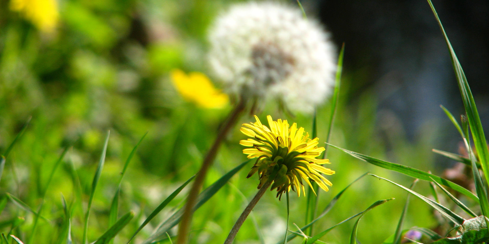

Patterns for Creativity: The Science and Magic of the Creative Process
======================================================================

----

**How can you be more creative in your professional life?**

Despite our best attempts, the creative process remains a beautifully elusive aspect of the human experience.  Scientific research taking a reductionist worldview has made little practical progress, and thinking about it from a magical perspective is not necessarily useful either.

This project is an experiment to better understand and document creativity from the perspective of daily practitioners.  We are **engineers** identifying techniques to apply methodically; we are **artists** collecting a repertoire of ideas to play with.  This is a work-in-progress, so feel free to contribute too!

1. `Our Motivation <#-our-motivation>`_
2. `The Topics <#-the--topics>`_
3. `The Concept <#-the--concept>`_
4. `Our Process <#-our--process>`_
5. `The Credits <#-the--credits>`_

|License Type|

🚀 Our Motivation
=================

By studying the praxis of creativity, we'd like to be able to answer these questions (in no particular order):

    How can we become more innovative and productive with less effort?

    What can creators do to become more relevant in an age of automation?

    How can people rehabilitate from losing their creativity in childhood?

    What distinguishes human creativity from machine generativity?

    How could we become comfortable with the creative process itself?

📝 The Topics
=============

Our focus is on professionals being actively creative as part of their work, in particular but not limited to::

    Musicians       Writers         Photographers       Comedians
    Poets           Chefs           Painters            Architects
    Designers       ...

Through interviews, we're identifying the different factors, patterns, techniques, and metrics that are frequently used in creative processes.

💡 The Concept
==============

* **Repository of Knowledge**: We use this repository as a place to store our findings about creativity.

* **Ongoing Experiment**: We'll leverage open-source platforms and social media to gather empirical data!

* **Practical Focus**: We'll turn all these insights into tools that can be easily used daily by practitioners.

* **Individually Generated**: We'll deliver the results and content in a way that's custom to each person.

⚙️ Our Process
==============

We're just getting started, so feel free to jump in!

1. **Hypotheses** — Establishing assumptions to validate, see `this thread <https://github.com/augmentati/creativity/issues/1>`_.

2. **Research** — Collecting material (e.g. `interviews <https://github.com/augmentati/creativity/issues/2>`_) for further study.
 
3. **Analysis** — Finding the underlying patterns in the data collected.

4. **Experiments** — Setting up and running experiments to test assumptions.

5. **Documentation** — Writing up the results and the patterns found.

6. **Assembly** — Building tools to provide content as personal suggestions.

✨ The Credits
==============

Artists
-------

**Project Banner** — Dandelion field adapted from `original photo <https://flic.kr/p/9BHtNk>`_ under CC-BY-NC-SA @charlierapple.

Special Thanks
--------------

* Petra Champandard-Pail

Inspiration
-----------

* Christopher Alexander
* Elizabeth Gilbert
* Sir Ken Robinson

----

|License Type|

.. |License Type| image:: https://img.shields.io/badge/license-CC--BY--NC--SA-blue.svg
    :target: https://github.com/augmentati/creativity/blob/master/LICENSE
